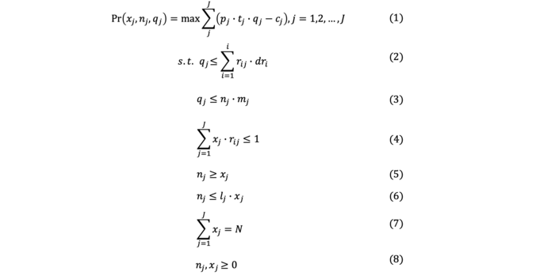
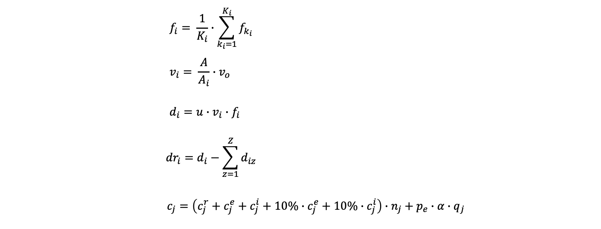

# Musk-Model
Finding the optimal location for public charging stations – a GIS based MILP approach

# Data Sources
Existing EV charger locations : https://www.gov.uk/guidance/find-and-use-data-on-public-electric-vehicle-chargepoints

Council Managed Car Parks : https://www.manchester.gov.uk/open/homepage/3/manchester_open_data_catalogue

Road shapefiles : https://www.ordnancesurvey.co.uk/business-government/products/open-map-roads

Land-use classification : https://data.gov.uk/dataset/8b8c5df3-d7e3-484c-89d8-c7b819205002/national-historic-landscape-characterisation-250m-grid-england/

Daily traffic flow : https://roadtraffic.dft.gov.uk/local-authorities/85

# Objective function and Constraints

It is assumed that each charger is possible to charge 𝑚 cars at most per day, and constraint (2) and (3) make sure that the cars charged in the station are less than both the capacity of the station and the charging demand. Constraint (4) ensures that the remaining charging demand in grid 𝑖 are in the service area of only one station, which ensures that different demand nodes are distributed to different charging stations. Formula (5) and (6) ensure that each station would have at least one charger and at most 𝑙𝑗 chargers, this can be determined according to the constraints at different points in the power grid. Moreover, the constraints also have the logical implication for example if there is no station, there is no charger and vice versa. Also, a company may have a maxmimum budget allocated to placing charging stations, so at most N stations would be placed in the city according to formula (7). Constraint (8) ensures all the decision variables are integers and non-negative.

# Equations

# Symbol Glossary
𝑥𝑗 = binary variable whether car park 𝑗 is selected for a charging station  
𝑛𝑗 = number of chargers in station 𝑗  
𝑞𝑗 = number of cars charged by station 𝑗  
𝑚𝑗 = maximum number of charging sessions per day in station 𝑗  
𝑙𝑗 = upper bound of chargers in station 𝑗  
𝑟𝑖𝑗 = binary variable which represents the service area coverage level of station 𝑗 on demand node 𝑖 (value is equal to 1 if service area coverage is <500m otherwise its 0) 
𝑓𝑖 = average traffic flow in grid cell 𝑖  
𝐾𝑖 = number of traffic flow measurement points in grid cell 𝑖  
𝑓𝑘𝑖 = daily traffic flow in grid cell 𝑖  
𝑣𝑖 = charging possiblility of an EV grid cell 𝑖  
𝑣0 = charging possibility in grid cell 𝑖 (dependant on the land-use classification) 
𝐴 = total area of grid cell 𝑖  
𝐴𝑖 = sum of mixed-use area in grid cell 𝑖  
𝑑𝑟𝑖 = remaining demand in grid cell 𝑖  
𝑑𝑖 = charging demand of an EV in grid cell 𝑖  
𝑑𝑖𝑧 = charging demand of an EV in grid cell 𝑖 already being met by existing station z  
𝑐𝑗 = total costs of station 𝑗  
𝑐𝑒𝑗 = capital cost of station 𝑗  
𝑐𝑖𝑗 = installation cost of station 𝑗  
𝑝𝑒 = price of electricity per kWh  
α = average capacity of EV battery (kWh)  

